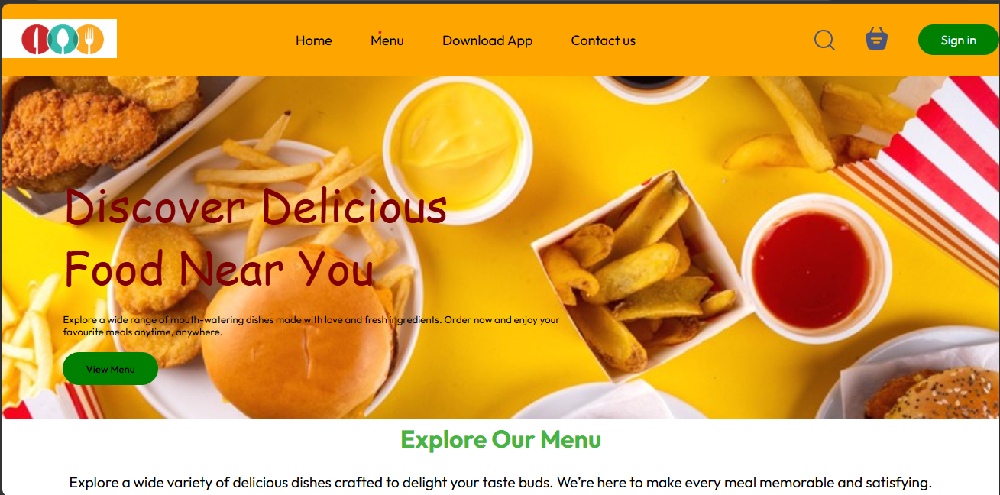
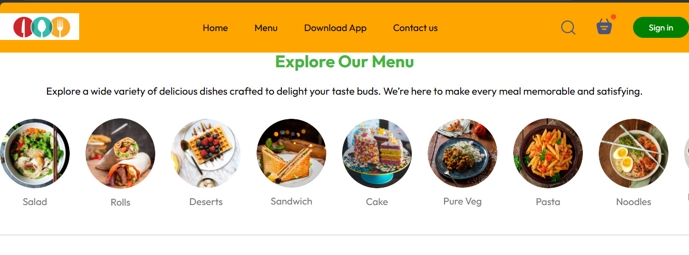
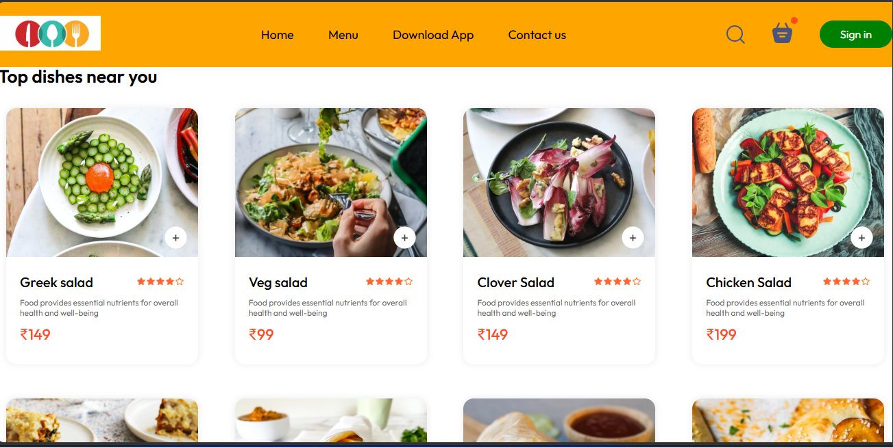

<h2 style="font-size:20px;">🍔 Online Food Ordering Website</h2>

📌 Project Overview

This project is a modern and responsive online food ordering website developed using HTML, CSS, JavaScript, and React.

The website provides users with a seamless and interactive food ordering experience. Users can browse food items, explore menus, add products to the cart, and place orders easily.

The application is fully responsive and works smoothly across desktop, tablet, and mobile devices.

✨ Features

🍕 Browse food categories and menu items

🛒 Add and remove items from cart

📱 Responsive design for all devices

⚡ Fast and interactive user interface

🎨 Clean and modern UI design

🔍 Easy navigation and smooth user experience

🛠 Technologies Used

🌐 HTML

🎨 CSS

⚡ JavaScript

⚛️ React

📸 Project Screenshot

🚀 Live Demo

This project has been successfully deployed and is now live. You can explore the website and experience all features in real time using the link below.

🌐 Live Website: (https://musical-kleicha-29370a.netlify.app/)

🎯 Project Objective

The main objective of this project is to build a real-world food ordering platform while improving frontend development skills, UI design understanding, and practical experience in modern web development.

👨‍💻 Developed By

    Zainab Ali
  

